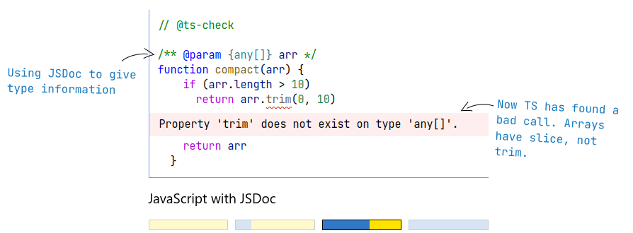

# TypeScript

L'Objectif est de voir les bases du langage **TypeScript** mais aussi de voir des trucs et astuces pour mieux l'utiliser

## Prérequis

- Être à l'aise avec JavaScript (ES6, Import...)
- NPM et l'environnement Node.js

## Qu'est-ce que TypeScript

TypeScript c'est un superset du **JavaScript**, c'est le langage **JavaScript** sur lequel on a rajouté des options supplémentaires et donc le TypeScript c'est du **JavaScript** avec des types statiques, donc par là il faut entendre que l'on a des petites annotations sur les types.

```{TS}
interface User {
  id: number
  firstName: string
  lastName: string
  role: string
}
 
function updateUser(id: number, update: Partial<User>) {
  const user = getUser(id)
  const newUser = { ...user, ...update }
  saveUser(id, newUser)
}
```

Il faut savoir que le **TypeScript** ne va pas être directement exécuté sur nos environnements, que ce soit le navigateur ou node.js, ce qu'il va falloir faire c'est convertir le code **TypeScript** en **JavaScript** et c'est la cible principale qui a été penser pour le **TypeScript**.
Donc finalement le code qui sera exécuté sur votre navigateur ou sur votre environnement `node.js`, ça sera du code **JavaScript** à partir de ça il faut comprendre que *la vérification de type sera à la **compilation** du code TypeScript et non à l'exécution du code JavaScript*.

## Pourquoi utiliser le TypeScript ?

- Le premier avantage est que ça va permettre de limiter les erreurs surtout les erreurs du type: `Uncaught TypeError: Cannot read properties of undefined (reading 'toLowerCase')`, c'est le genre d'erreur que l'on a lorsqu'une fonction reçois un objet qui n'a pas la forme que nous on attendait, on essaie ensuite d'accédé à une propriété qui n'existe pas. Ces genres d'erreurs **TypeScript** serait capable de les capturer en amont avant même que notre code soit exécuté.
- Une autre type d'erreur que l'on peut rencontrer c'est sont par exemple des petites fautes d'inattention surtout lors des calculs mathématiques.
- TypeScript permet aussi une meilleure autocomplétion et documentation et qui est bien plus poussée que la JSDoc car nos éditeurs utilisent les fichiers TypeScript pour documenter les fonctions de base telle que les fonctions du DOM ou les fonctions node.js
- Le TypeScript permet d'avoir une cible plus simple, même si le JavaScript n'arrête pas d'évoluer, le TypeScript peut être converti en `ES3`, `ES5`,... jusqu'à de `ESNext` donc l'avantage quand on écrira du code `TypeScript`, on se contentera de cibler une version spécifique du JavaScript et ensuite on pourra lui demander d'exporter comme on le souhaite et cela va permettre de se passer des outils comme `babel` et de simplifier un peu le travail.

- On peut utiliser TypeScript à différent niveau
  - On peut choisir d'avoir TypeScript qui va simplement vérifier notre code et pour cela il faut ajouter `@ts-check` au-dessus de votre code, dans ce cas il va afficher les erreurs dans votre éditeur 
  - Ou créer des fichiers TypeScript qui seront par la suite compiler en fichier JavaScript.

## Comment utiliser TypeScript

Pour exécuter du TypeScript il faudra le convertir en JavaScript, et pour cela on a deux outils :

- On a le `checker`, qui va permettre de valider votre code, mais la plupart des éditeurs modernes comme VScode intégrer déjà ces outils-là, voilà pourquoi quand vous aurez des erreurs dans votre code ils seront directement détecté et souligner, donc cette étape de vérification on peut le laisser coté éditeur.
- Ensuite on a une partie `compiler` qui prend votre code TypeScript et le convertir en JavaScript en retirant les types, mais rien vérifier du tout.

### Outils

Pour les outils d'utilisations pour
Conversion en JavaScript on a :

- TypeScript (tsc)
- Webpack (TS-loader)
- Parcel
- ESBuild
- Vite (via ESBuild)

## Installation et Utilisation

Pour installer TypeScript il faut le faire en utilisant `npm` on a `npm install typescript --save-dev` et `pnpm` avec `pnpm add typescript -D`.

Pour maintenant utiliser le TypeScript il faut utiliser des fichiers avec une extension `.ts` par exemple `app.ts` et à l'intérieur de ces fichiers on y écrit du code TypeScript.
Une fois que l'on a écrit notre code TypeScript il faut maintenant le compiler en fichier JavaScript et pour cela on utilise la commande `npx tsc LeNomDuFichier-A-Compiler.ts`; et si vous voulez dans cette ligne de commande on peut utiliser pas mal d'argument pour aller encore plus loin, par exemple ajouter un watcher qui va écouter le changement sur notre fichier TypeScript et le compiler à chaque détection d'un changement avec `npx tsc LeNomDuFichier-A-Compiler.ts --watch` ou en spécifiant le dossier ou doit se faire la compilation avec `npx tsc LeNomDuFichier-A-Compiler.ts --outDir leDossierOuOnVaCompiler` et pour éviter de répéter ce drapeau, ce que l'on va faire c'est créer un fichier de configuration appeler `tsconfig.json` qui va contenir maintenant l'ensemble des règles que l'on veut respecter à la compilation, ce fichier est écrit en format JSON et contient les règles de la forme suivante :

```{JSON}
// Contient les informations pour compiler le projet
{
    "compilerOptions": {
        // Le dossier de sortie de nos fichier javascript
        "outDir": "dist",
        // La version javascript qu'on cible
        "target": "ES2015",
        // Compile le code que si il n'y a pas d'erreur, ainsi ça nous permet de vous rassurer que le fichier JS compiler ou generer ne contient pas d'erreur
        "noEmitOnError": true,
        "strict": true,
        // On ecoute à chaque fois qu'il y a des modifications
        "watch": true
    },
    // Le fichier à inclure dans le  programme
    "files": [
        "./src/app.ts"
    ]
}
```

## Syntaxe de base

Dans la syntaxe de base on va voir beaucoup plus sur les types de variable et comment les utiliser ainsi que les différentes variations.

### Type de variable

Pour déclarer les types de variables il suffit d'utiliser un deux point ":" devant le nom de la variable suivi du type que l'on souhaite utiliser et puis on égalise de sa valeur initiale si on veut

```{TS}
const greet:string = "Hello world";
const nbrZero:number = 0;
const isBooleanVal:boolean = false;
const nullVal:null = null;
const anArrayOfString:string[] = ['lol','Bum'];
const allTypesYouWant: any = [ "Abel", { user: { username: "Lolo" } }, "Gloire", 3, false ];
```

⚠ Le type `any` ça permet de dire n'importe quoi, c'est un type un petit peu fourtout et c'est un type que l'on évitera au maximum d'utiliser, `any` vous pouvez le mettre n'importe où, mais c'est un type qui est un peu trop gros, car quand vous utilisez cela veut dire que vous ne connaissez pas la forme de cette variable et que tout au long de l'exécution vous n'avez aucune idée de ce qu'il y a dedans donc ce n'est pas très pratique.

Sachez que vous pouvez aussi préciser la forme des objets en utilisant une syntaxe ressemblant un peu à une syntaxe objet et pour cela on crée une variable encore et puis un deux point ":" devant son nom suivi d'un objet qui va décrire l'objet en question et cela se fait en mettant sur chaque clé d'un objet on lui met deux point son type.

```{TS}

const user:{username:string,firstname:string,lastname:string} = {username:'',firstname:"",lastname:''};
// Si votre objet a une infinité de clé vous pouvez aussi le decrire comme suit
const user:{username:string,firstname:string,lastname:string,[key:string]:string} = {username:'',firstname:"",lastname:''};

```

⚠ On a aussi un autre type qui est le type `never`, c'est un type qui est souvent autogéré par le narrowing et qui est là pour vous dire `"Ce type de variable n'existera jamais que vous avez obtenus"` ou vous dire que `"la condition que vous avez ne va jamais se resoudre et n'a pas de sens"`.
Pour des objets qui correspondent à des types spécifiques vous pouvez simplement mettre le nom de l'objet:

```{TS}
const date:Date = new Date()

```

### Typage des fonctions

Le typage des fonctions, c'est comme pour les variables simples, c'est-à-dire le nom de la fonction puis son type qui est `Function` avec:

```{TS}
const cb:Function = ()=>{
    
}
// Pour les paramètres des fonctions c'est le meme principe que pour le type de variable
const cbTest:Function = (e:MouseEvent)=>{
}
function printId(id:number):void {

}
// J'attends une fonction qui prend en paramètre un element de type MouseEvent et qui ne retourne rien
const whenUserClick:(e:MouseEvent)=>void = (e)=>{

}

```

⚠ Quand vous utilisez le mot clé `void` cela veut dire que le retour ne sera pas utilisé, mais si vous avez une fonction void qui retourne quelque chose et que vous utilisez la valeur retourner, dans ce cas cela va générer une erreur.

Dans certaines situations, il ne va pas être capable de deviner le type, surtout pour les éléments du DOM et quelques spécificités. Pour remédier à cella, vous pouvez utiliser ce que l'on appelle **l'assertion de type** et c'est indiquer à TypeScript `de quel type va etre ce retour là` et pour cela on utilise deux notions, l'un en utilisant le mot clé as et l'autre en utilisant une syntaxe similaire au JSX et il respecte et vérifie cela en se basant sur le checker installer.

```{TS}
const button = document.querySelector('#compter') as HTMLButtonElement
// ou
const btn = <HTMLButtonElement>document.querySelector('#compter-2');
```

### Le type union ou l'union type

C'est quant une variable ou le dériver d'une variable peut prendre deux types ou plusieurs types, dans ce cas-là, vous pouvez utiliser **l'union type** dans cette situation.
L'union type est symbolisé par une barre verticale qui permet de séparer les type que l'on veut énumérer.
Imaginons qu'on a une fonction qui attend en paramètre un nombre ou une chaine de caractère dans ce cas :

```{TS}
function printId(id: number | string) {

}
```

### Narrowing

Le Narrowing c'est un système qui permet à TypeScript d'éliminer des cas et de réduire les types possibles pour vos variables.
On peut avoir du narrowing grâce aux **`condition`**, au mot clé **`typeof`** et mot clé **`instanceof`**

```{TS}
function printId(id: string | number) {
    if (typeof id === "number") {
        console.log((id * 3).toString());
    } else {
        console.log(id.toUpperCase());
    }
}
```

Il permet aussi de détecter le type d'une manière automatique au fur et à mesure de l'exécution du code TypeScript surtout quand on ne sait pas d'avance que sera le type d'une variable qui est composé de plusieurs type, le narrowing nous permet de diminuer les possibilités.
Grace aux narrowing on peut utiliser de notation comme "`variable is TypeOfObject`" comme :

```{TS}

function isDate(a: any): a is Date {
    return a instanceof Date;
}
function example(a: Date | HTMLInputElement) {
    if (isDate(a)) {
        return a.getTime();
    }
}
```

Le principe du narrowing est très utile, c'est lorsque vous avez quelque chose qui peut avoir plusieurs type, maintenant vous raccourcissez les possibilités via des **`condition`**, au mot clé **`typeof`** ou au mot clé **`instanceof`** vous pouvez réduire le type pour être sure du type dans une condition et cela vous permet de faire votre script convenable et des fois d'éliminer la valeur `null`.

Pour faire du narrowing de force on utilise le point d'exclamation à la fin de la déclaration du valeur d'une variable ou une assertion de type avec le mot clé `as`, et cela, pour dire que `Le contenu de cette variable ne peut etre null`, mais pour cela il faut être à 100% sûre que cet élément existe dans la page, car vous empêcher une vérification que TypeScript a faite, mais on préfèrera utiliser le narrowing basé sur les conditions, car au moins ça permet au code de gérer les cas où les formats qui est reçus en paramètre ne correspond pas à ce que l'on attend.

```{TS}
const button = document.querySelector('#compter')!
const btn = document.querySelector('#compter') as HTMLButtonElement
```

### Alias et Générique

Dans certaines situations certains types peuvent être compliqué et à cause de cela ça peut être pénible de se répéter si on doit utiliser ce même type dans notre code une fois encore ou plusieurs fois de suite.
Alors pour remédier à ce problème, vous pouvez créer un Alias de type qui va permettre d'avoir un mot clé pour utiliser ce type là.
En général le nom des Alias est en majuscule et pour le créer il faut commencer par le mot clé `type` suivis du nom de l'alias que vous voulez créer puis l'égaliser à la description que vous voulez, et pour l'utiliser il faut le faire juste comme pour le variable avec un deux point ":" suivis du nom de l'alias que vous voulez utiliser.

```{TS}
// On créer un Alias
type User = { username: string, firstName: string, lastName: string,email:string,password: string}
// On utilise notre alias
const user:User = {username:"Ndekocode",fistName:"Arick",lastName:"Bulakali",email:"arickbulakali@ndekocode.com",password:"lolololol"}
```

Le générique, c'est le truc le plus puissant que l'on a au niveau de TypeScript
On les utilise de différente manière comme ces trois car:

```{TS}
// On les utilisent pour typer le contenu d'un tableau
const genericArray: Array<string | number> = [ "Lol", "Learn", 3 ];

//Pour un retour previsible d'une fonction dependant des paramètres Generic on function definition which retourn the type of arg params
function identity<ArgType>(args: ArgType): ArgType {
    return args;
}
function firstIndice<Type>(arg: Type[]): Type {
    return arg[ 0 ];
}
// Add a contrain to a Generic: l'argument doit avoir obligatoirement un attribut length
function consoleSize<Type extends { length: number }>(arg: Type): Type {
    console.log(arg.length);
    return arg;
}
// tab type:String: Dynamic par rapport à ce que on lui passe en argument
const abb = consoleSize("Apprendre");
// tab type:String: Dynamic par rapport à ce que on lui passe en argument
const tab = firstIndice([ "Bum", "Mub", "ubM" ]);

// Dynamic par rapport à ce que on lui passe en argument
const varIdentity = identity("Hello");
```

Souvent les generics on aura tendances à les nommer avec une seule lettre en majuscule, mais vous pouvez utiliser plusieurs lettres si c'est plus claire pour vous, car l'objectif, c'est de comprendre le type que vous voulez spécifie et nom la façon de l'écrire.

### Readonly

Readonly est une propriété en TypeScript qui permet de dire qu'une variable est en lecture seul, `readonly` se met devant le type d'une variable et une fois cela fait il permet de dire que la variable ne peut subir de modification mutable(c-à-d des modification qui peuvent altérer la référence variable), donc que la variable ou la propriété qui est en `readonly` ne peut être modifié et donc pour les type `Array` on ne peut pas utiliser les méthodes `push, unshift, reverse` qui modifie le tableau lui-même ainsi que ces référence

```{TS}
function reverse<T>(arg: readonly T[]): T[] {
    return arg.slice();
}
```

On peut même mettre l'attribut readonly même devant le type de retour d'une fonction pour dire que le retour de la fonction ne peut être modifié.
Ce drapeau `readonly` peut être rajouté devant n'importe quel type.
Pour le type `Array` et `object` les meilleures façons de contourner le `readonly`, c'est de cloner le tableau ou l'objet avec n'importe quoi comme le `spread Operator` ou avec le JSON puis c'est sur ce nouveau tableau ou objet que l'on va faire nos traitements comme ça on ne modifie pas le drapeau original et on a résolu ce problème là.s

## Les class

Le TypeScript se calques sur les nouvelles fonctionnalités du JavaScript, du coup les classes en TypeScript fonctionnent comme les classes en JavaScript classique, la spécificité en TypeScript est que l'on va pouvoir rajouter un modificateur devant les propriétés et les méthodes pour spécifier sa visibilité comme dans les langages orienter objet classique et pour cela on a trois type de visibilités :

- `private`: une propriété qui est privé ne peut être accéder qu'à l'intérieur de la classe
- `private`: une propriété qui est protéger ne peut être accéder qu'à l'intérieur de la classe, mais aussi à l'intérieur des classes enfants de la classe détentrice de la propriéter dite protéger

### Le DOC typing

- On dit souvent: si ça fait coak et que ça marche comme un canard, donc c'est un canard, Car TypeScript ne vérifie pas vraiment si c'est vraiment l'instance de quelque chose, il se contente seulement de vérifier la forme.

```{TS}
class Point {
    x: number = 0;
    y: number = 0;
}

class Geometry {
    x: number = 0;
    y: number = 0;
    suface: number = 0;
}
// Typescript va laisser passer toutes les classe qui ont comme proprieter x ie il va juste verifier la forme et non si c'est une instance de P
function getX(p: Point): number {
        return p.x;
}
const x = getX(new Geometry())
console.log(x);
// C'est donc à nous de faire les verification necessaire avec instanceof
functin getY(p: Point) {

    if (p instanceof Point) {
        return p.y;
    }
    throw Error("Not an instance of Point");
}
// Va retourner une erreur
const y = getY(new Geometry());
console.log(y);
// Va passer sans probleme
const newY = getY(new Point());
console.log(newY);
```
